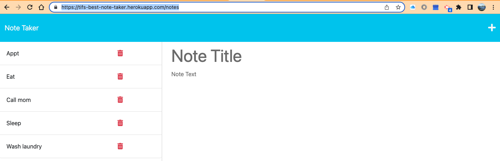
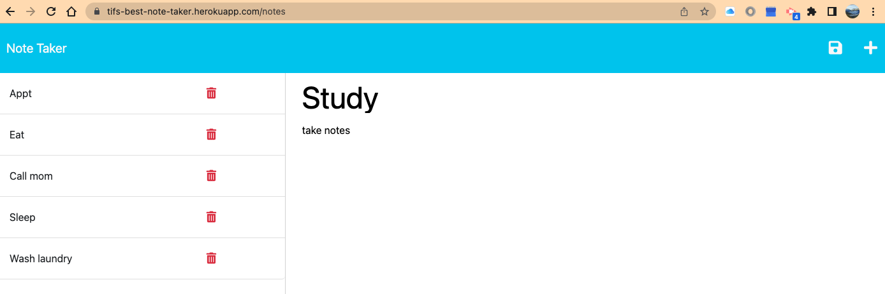

# Best Note Taker

## Description
 Application that can be used to write and save notes. 

[](n/a)

## Git Hub Repository
https://github.com/tasshroll/best-note-taker

## Heroku Deployed Site
https://tifs-best-note-taker.herokuapp.com/

## Screenshot
Add a new Note


Save a note, click floppy disk


## Table of Contents

[Installation](#installation)

[Usage](#usage)


## Installation
 The application has a front end (index.html, notes.html, index.js). This application uses an Express.js back end and will save and retrieve note data from a JSON file named db.json. The application is deployed to Heroku.
 To run locally, Type;
 ```
 npm i 

 npm i express
 ```

## Usage
Run from:  https://tifs-best-note-taker.herokuapp.com/

 Or run locally, type

 ```
 nodemon server.js
 ```

 Nodemon is a command line tool that automatically restarts the node application when it detects changes.

 Open a browser and type localhost:3001 to open application. Enter and delete notes. You will see notes added or deleted on the left side of the column.
```
## Criteria
AS A small business owner
I WANT to be able to write and save notes
SO THAT I can organize my thoughts and keep track of tasks I need to complete

```
## Acceptance Criteria
```
GIVEN a note-taking application
WHEN I open the Note Taker
THEN I am presented with a landing page with a link to a notes page
WHEN I click on the link to the notes page
THEN I am presented with a page with existing notes listed in the left-hand column, plus empty fields to enter a new note title and the note’s text in the right-hand column
WHEN I enter a new note title and the note’s text
THEN a Save icon appears in the navigation at the top of the page
WHEN I click on the Save icon
THEN the new note I have entered is saved and appears in the left-hand column with the other existing notes
WHEN I click on an existing note in the list in the left-hand column
THEN that note appears in the right-hand column
WHEN I click on the Write icon in the navigation at the top of the page
THEN I am presented with empty fields to enter a new note title and the note’s text in the right-hand column
```


